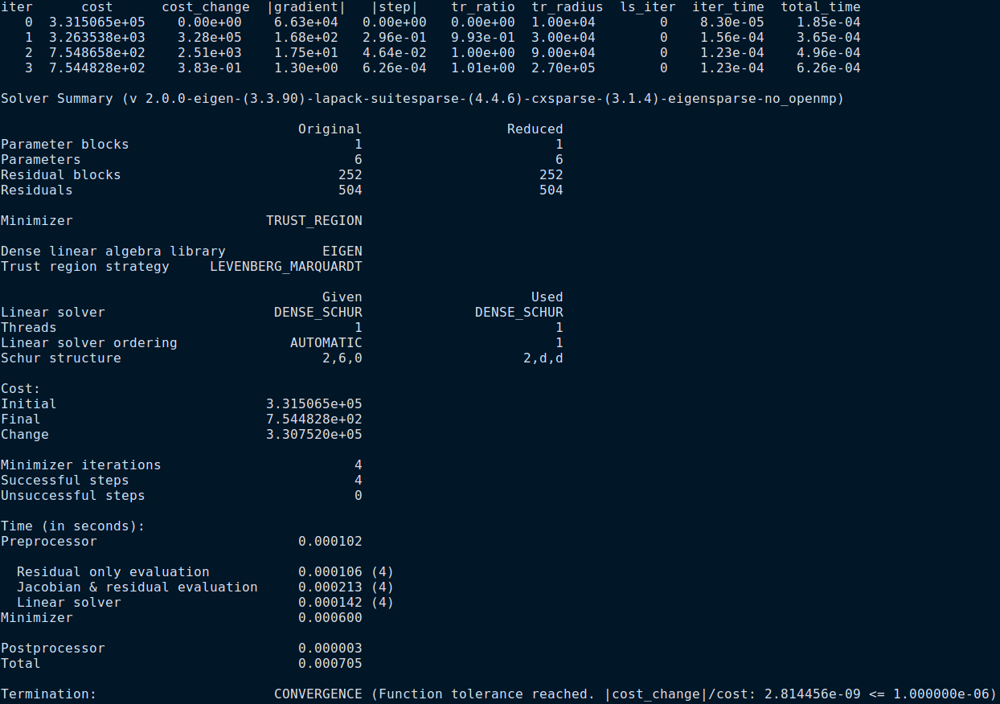

# Auto Diff on Manifold using Ceres Solver 
---
This repository contains the implementation of optimazation on Lie group(manifold) using ceres solver auto-diff feature.  
**Ceres automatic differentiation** is a technique that can compute exact derivatives, fast, while requiring about the same effort from the user as is needed to use numerical differentiation. 
More details and introduction can be found [here](http://ceres-solver.org/automatic_derivatives.html)

Here we use two methods (Analytic Derivatives / Automatic Derivatives ) to solve camera pose estimation problem

## 0. Experiment Data 
  I use real data from **Euroc** to compare different two methods.

red : ground truth pose, green : estimated pose, blue : initial pose

## 1.Analytic Derivatives
Analytic derivatives is a fast way to complete optimization task. Users should give jacobian of the cost function to ceres solver. When deal with optimization problem on the manifold, we should also provide local-parameterization function. Since the states are not euclidean, which you will find in `re_projection_error.h`(`PoseSE3Parameterization`). Enable local-parameterization when you use `AddParameterBlock` function.
## 2.Automatic Derivatives
Automatic Derivatives is a powerful feature in ceres solver, which allows you to avoid complicated jacobian calculations. However get similar result compared to analytic derivatives. Although there will be a loss of computational efficiency, the difference is negligible on small-scale issues. 

## 3.Prerequisites
  ### Ceres Solver 
  Ceres solver (Version 1.14.x) is required.  
  ### Pangolin
  We use [Pangolin](https://github.com/stevenlovegrove/Pangolin) for visualization and user interface. Dowload and install instructions can be found at: https://github.com/stevenlovegrove/Pangolin.

  ### Eigen3 
  Eigen3.3.9 has been tested. 

## 4.Build and Run 
I provide a script `run.sh` in the project directory for you to build and run the code. You can change `use_analytic` in code to change the optimization mode.

## 5. Result 

### 5.1 Result of automaitc derivatives optimization 

### 5.2 Result of analytic derivatives optimization  

As you can see, the results and time-consuming are almost the same.

## Reference 
[1] https://fzheng.me/2018/01/23/ba-demo-ceres/   
[2] https://blog.csdn.net/Curryfun/article/details/106245458  
[3] http://ceres-solver.org/automatic_derivatives.html