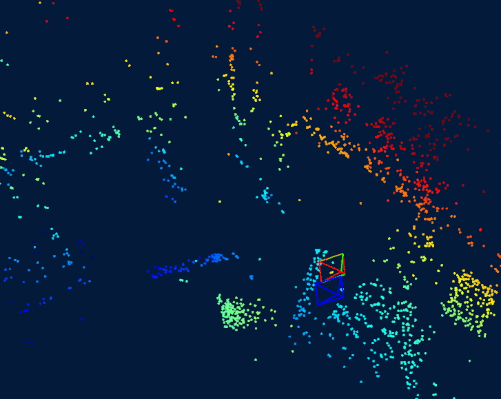

# Auto Diff on Manifold using Ceres Solver 
---
This repository contains the implementation of optimazation on Lie group(manifold) using ceres solver auto-diff feature.  
**Ceres automatic differentiation** is a technique that can compute exact derivatives, fast, while requiring about the same effort from the user as is needed to use numerical differentiation. 
More details and introduction can be found [here](http://ceres-solver.org/automatic_derivatives.html)

Here we use two methods (Analytic Derivatives / Automatic Derivatives ) to solve camera pose estimation problem

## 0. Experiment Data 
  I use real data from **Euroc** to compare different two methods.

red : ground truth pose, green : estimated pose, blue : initial pose

## 1.Analytic Derivatives

## 2.Automatic Derivatives

## 3.Prerequisites
  ### Ceres Solver 
  Ceres solver (Version 1.14.x and 2.0 have been tested) is required.  

  ### Pangolin
  We use [Pangolin](https://github.com/stevenlovegrove/Pangolin) for visualization and user interface. Dowload and install instructions can be found at: https://github.com/stevenlovegrove/Pangolin.

  ### Eigen3 
  Eigen3.3.9 has been tested. 

## 4.Build and Run 
I provide a script `run.sh` in the project directory for you to build and run the code. 

## 5. Result 

### 5.1 Result of auto-diff optimization 

### 5.2 

